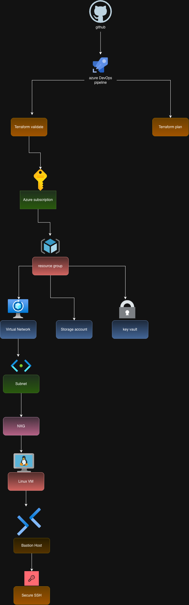

# Azure Landing Zone using Terraform

## Project Overview

This project demonstrates how to build a modular Azure Landing Zone using Terraform and Azure DevOps.

The infrastructure is designed using reusable Terraform modules and supports multiple environments such as Development, Test, and Production.

The project follows Infrastructure as Code (IaC) principles, enabling automated, scalable, and repeatable Azure deployments.
## Features

- Modular Terraform Architecture
- Multi-Environment Support (Dev, Test, Production)
- Azure Resource Group
- Virtual Network (VNet)
- Subnets
- Network Security Group (NSG)
- Route Table
- Azure Bastion Host
- Linux Virtual Machine
- Azure Key Vault
- Azure Storage Account (Terraform Backend)
- Azure Log Analytics Workspace
- VNet Peering
- Azure DevOps CI Pipeline
- GitHub Integration
- Infrastructure as Code (IaC)
## Technologies Used

| Technology | Purpose |
|------------|---------|
| Microsoft Azure | Cloud Platform |
| Terraform | Infrastructure as Code |
| Azure DevOps | CI Pipeline |
| Git | Version Control |
| GitHub | Source Code Repository |
| Azure CLI | Azure Authentication & Management |
| Bash | Automation Scripts |
## Architecture Overview

```text
                 GitHub Repository
                        │
                        ▼
             Azure DevOps Pipeline
                        │
        ┌───────────────┴───────────────┐
        │                               │
 Terraform Validate              Terraform Plan
                        │
                        ▼
              Terraform Apply
                        │
                        ▼
                Azure Subscription
                        │
                Resource Group
                        │
        ┌───────────────┼────────────────┐
        │               │                │
      VNet         Storage Account    Key Vault
        │               │                │
     Subnet         Terraform State   Secrets
        │
        ▼
       NSG
        │
        ▼
    Linux VM
        │
        ▼
 Azure Bastion Host
        │
        ▼
 Secure SSH Access
```
## Deployment Steps

### 1. Clone the Repository

```bash
git clone https://github.com/<your-github-username>/azure-landing-zone.git
```

### 2. Navigate to the Environment

```bash
cd azure-landing-zone/environments/dev
```

### 3. Initialize Terraform

```bash
terraform init
```

### 4. Validate Configuration

```bash
terraform validate
```

### 5. Preview Infrastructure Changes

```bash
terraform plan
```

### 6. Deploy Infrastructure

```bash
terraform apply
```
## CI Pipeline

The project includes an Azure DevOps Continuous Integration (CI) pipeline.

The pipeline performs the following tasks:

- Checkout source code from GitHub
- Install Terraform
- Initialize Terraform
- Validate Terraform configuration
- Generate Terraform execution plan

### Pipeline Flow

```text
GitHub
   │
   ▼
Azure DevOps Pipeline
   │
   ▼
Terraform Init
   │
   ▼
Terraform Validate
   │
   ▼
Terraform Plan
```
## Future Enhancements

- Multi-stage Azure DevOps Pipeline
- Manual Approval before Apply
- Azure Key Vault Integration with Pipeline
- Docker Integration
- Azure Container Registry (ACR)
- Azure Kubernetes Service (AKS)
- Monitoring and Alerting
## Author

**Praveen Mahobiya**

Azure | Terraform | Azure DevOps | Infrastructure as Code
## Terraform Modules

| Module | Purpose |
|---------|---------|
| Resource Group | Creates Azure Resource Group |
| Virtual Network | Creates Azure VNet |
| Subnet | Creates Subnets inside the VNet |
| Network Security Group | Configures network security rules |
| Route Table | Manages routing rules |
| Storage Account | Stores Terraform remote state |
| Key Vault | Securely stores secrets |
| Log Analytics | Collects monitoring logs |
| Virtual Machine | Creates Linux Virtual Machine |
| Bastion | Provides secure VM access |
| VNet Peering | Connects Virtual Networks |
## Skills Demonstrated

- Infrastructure as Code (IaC)
- Terraform Module Design
- Azure Networking
- Azure Security
- Azure Storage
- Azure Key Vault
- Azure Virtual Machines
- Azure Bastion
- Azure DevOps CI
- Git & GitHub
- Infrastructure Automation
# Azure Landing Zone using Terraform



## Project Overview